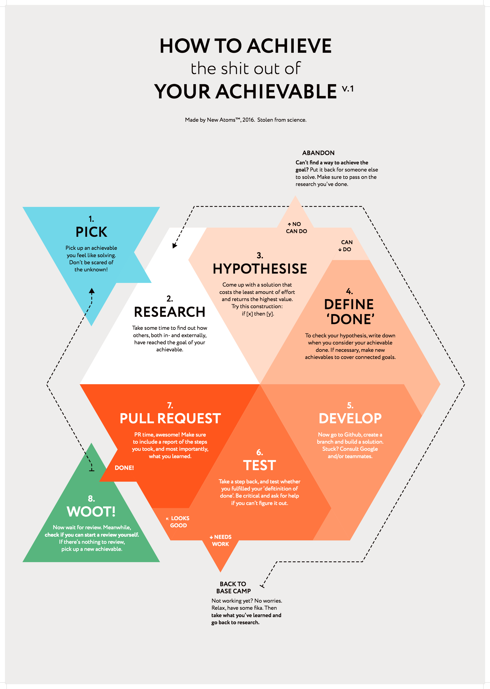

> **Goal of this guide**: After reading this you know what steps to take in order to achieve an achievable.

# How to achieve your achievable

[Achievables](../glossary/achievable.md) are the core, the foundation, the building blocks of New Atoms. Nothing happens without them. This infographic will show you what to do when you decide to produce one.

