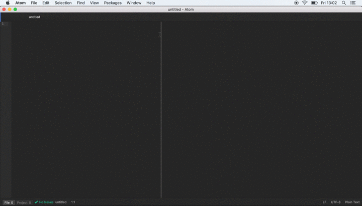

> **Goal of this guide:** showing the basics of using Atom to start working with atom in combination with github desktop.

# How to use text-editor [Atom](https://atom.io)

Atom is a very handy plain text/code writer that is free of all the formatting of text programs such as Microsoft Word and Google Docs yet very customizable. Atom enables you to think more about the content you're writing and its structure than the design. You can use it for programming (HTML, CSS, Javascript etc.) or pure content developement in [Markdown](https://github.com/newatoms/guides/tree/ready/github-guide#markdown-).   

For example, what is called "italic" in Word is essentially "emphasized" in Atom, and what is called "bold" is simply "important". This enables designers to display "important" information in a way of their choosing. Some might choose to display it in bold, but others might change the color or the font size.

You can also change the way Atom looks and behaves by installing packages and themes. Among other things, this can increase the readability of your text/code. Themes can change things like the background color of Atom. Packages will 'read' your text and do certain things based on certain rules. They can for example assign colors, display icons, remove redundant white spaces, automatically fill in line of code.. etc. Ask a team member what set of themes/packages we're using at the moment.

When working local you can use this text editor together with [github desktop](https://desktop.github.com/) for a more seamless flow. We use Atom together with Github to edit text and code; you can find our [Github guide here](../github-guide/readme.md)

## Handy shortcuts

ctrl+tab -> switch tab cmd+arrow -> select whole line (combine with shift to select)
fn+arrow -> move to end of document (combine with shift to select)

ctrl+shift+m -> Markdown preview

cmd+` -> shift between windows of the same application

ctrl+tab -> scroll through tabs in current window

## Packages and themes

install

**packages**

linter-js-standard

set-syntax

**themes**

monokai
