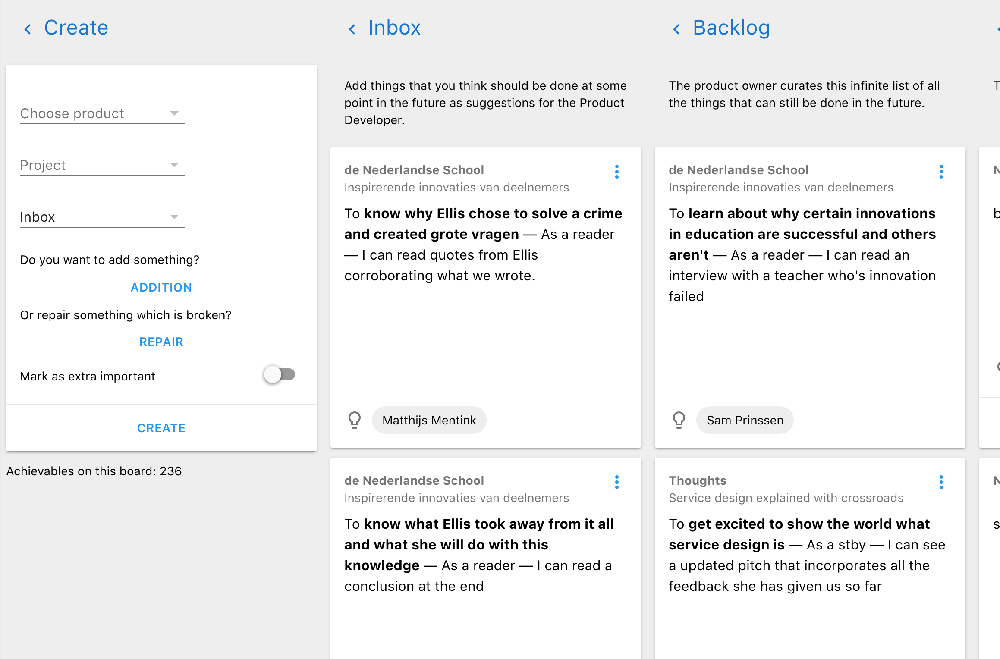

> *Goal of this guide:* Explain how to work with the achievable board in the interface and with achievables.

# How to use the achievable board

The main tool in our process is the achievable board. The board is the place where we keep track of our ideas, where they are in their lifecycle and who is working on what.

## The life of an achievable

From creation to going live [achievables](../glossary/achievable.md) go through distinct phases, like growing up. On the board there is one column for every [phase](../glossary/phase.md) an achievable is in.

Through its life an achievable travels from left to right.

The first phase is the ‘creation’ phase and the last one is the ‘live’ phase, which is when the achievable has been achieved, it is out there in the world and out of our hands.

In every phase an achievable has offers kinds of actions you can perform on it. For instance in the ‘next’ phase you can assign an achievable to you and move it to ‘in progress’ while if you have an achievable assigned to you for review it enables you to mark it as merged by moving it to the ‘ready’ phase.

At the top of every column on the board there is a description of what that phase is and what it means for the achievables.

## Some achievables are more important than others

