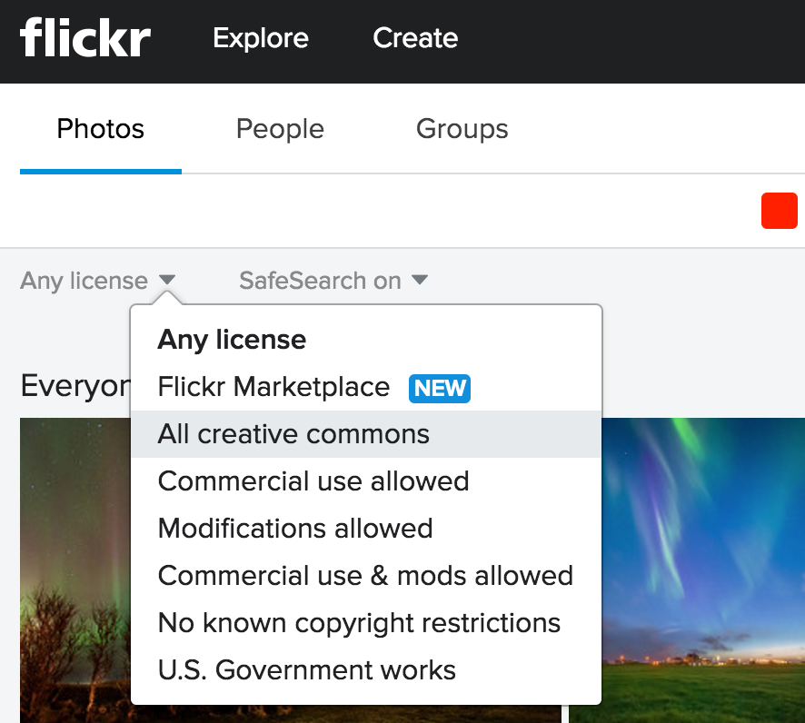
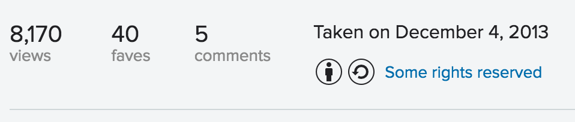
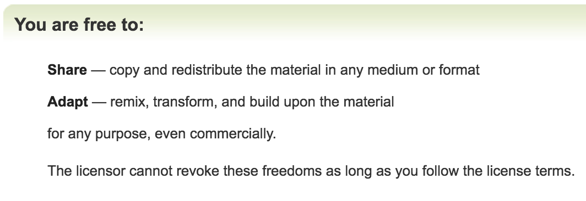

> **Goal of this guide**: helping you find an image you can use.

# How to find an image you can use?
Most of the times Google image search is not enough. Before searching for an image that fits your content, [learn what makes an effective image](../effective-image-guide/readme.md).

## So where to go?

- use the famous photography platform [Flickr](https://www.flickr.com/) and dive in to an abundance of images you can use from amateur and professional photographers all over the world. It's smart to filter your keywords on different licenses among others: ```Commercial use allowed``` and ```Modifications allowed```. Always check which rights the artist reserved and watch the copyright.  





- go to the amazing [Image Galleries of NASA](https://www.nasa.gov/multimedia/imagegallery/index.html). All pictures are public domain.
- go to [reddit.com/r/pics](https://reddit.com/r/pics), enter a search term and filter on ```top```. These images are not guaranteed to be copyright free, but they are indicative of what people like to see.
- use [Google image search](https://images.google.com/). You can also filter on the copyright by selecting search tools and then ```usage rights```.

### These websites are also helpful and fun to sneek around:

* [Unsplash](https://unsplash.com/)
* [Foter](http://foter.com/)
* [New York Public Library Pictures](http://publicdomain.nypl.org/pd-visualization/)
* [New Old Stock](http://nos.twnsnd.co/)
* [Public Domain Images](http://www.public-domain-image.com/)
* [Public Domain Archive](http://publicdomainarchive.com/)


## Image resizing for social media

Sprout social build a [tool](http://sproutsocial.com/landscape) which makes cropping for social media messages very easy.
