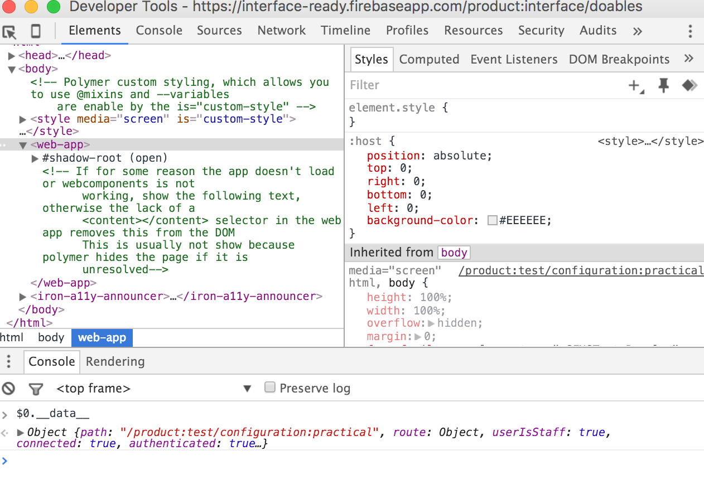

>**The goal of this guide:** Create a understanding of debugging websites/software. If you come across terms you don't understand, Google them or feel free to ask a team member within digital reach.

# How to Solve Polymer Errors

## The console

#### In Chrome
**cmd-alt-i** will open the developer tools. In the console you can see errors. On the right-hand side, each error states on which line of a certain element it originated. This enables you to quickly find small mistakes like a missing "," or "}".

Sometimes, the error will be fired from code we haven't written ourselves. Do not change these scripts!👎 Try to deduce why the script would fire an error and solve it in your own element(s).

Google the error message—most of the time somebody else has encountered the same problem and some nice human offered an answer.

***Just make sure you don't spend x hours reading Stackoverflow topics! If you don't find the answer quickly, ask a team member or try solving it in a different way.***

Check whether the data in the elements is what you would expect it to be. In the developer tools window you can find the tab "elements". All the elements used on this page can be seen and investigated here. They are ordered from parent to child, so some elements are hidden quite deeply. Expand an element by pressing the ▶︎.

> Use right mouse button -> inspect on a part of the website to quickly select an element for further inspection in the developer tools.

When you have found and selected the element (click on the line where the element starts), you can do all kinds of things with it from the console.

``` Javascript
$0.propertyName
```

will give the value of the property.


``` javascript
$0.__data__
```

shows all the properties of the element.

``` javascript
$0.functionName()
```
will call a certain function.



>Also quite useful:
[Polymer ready extension](https://chrome.google.com/webstore/detail/polymer-ready/aaifiopbmiecbpladpjaoemohhfjcbdk):
This extension enables you to see which elements are running on a certain site. Clicking an element will highlight where the element can be found.

## In your element

In a Javascript function you can log information 📓. This information can be seen in the console of the developer tools:
``` javascript
testFunction: function (inputArgument) {
  console.log('enter static text', this.propertyName, inputArgument)
}
```

In HTML you can use text to see whether certain parts of the script are run. For example, if you have a dom-if statement you can see whether the text is printed in the browser:
``` html
<template is="dom-if" if="{{staffUser}}">
  User works at New Atoms
</template>
```

In a dom-repeat you can "print out" all the values of the [items] array you feed the dom-repeat.
``` html
<template is="dom-repeat" items="{{items}}">
  {{item.userName}}
</template>
```

In the element in the browser, this will show the name for all the items in the array beneath one another (userName is arbitrary, not standard Polymer 😁)

## General tips

Ask help from teammates or the internet. Don't spend too much time searching for an answer. It reduces flow, motivation and productivity.📉 There is no prize for figuring it out on your own! ❌🏆❌

It often helps to delete everything and start again. Seriously, it won't take as long the second time and the code is often much better!

Improve the names of your properties, element, functions, etc. Often by renaming you get new insights or see things more clearly.🔎

Keep the format of your element according to [our rules](https://github.com/newatoms/interface/blob/ready/docs/style-guide.md).
