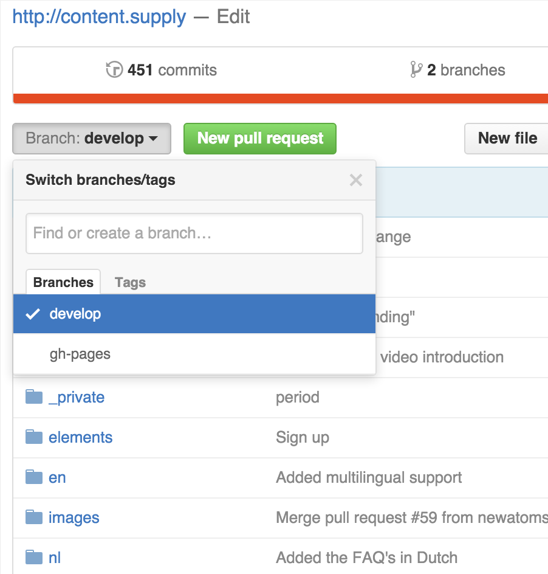
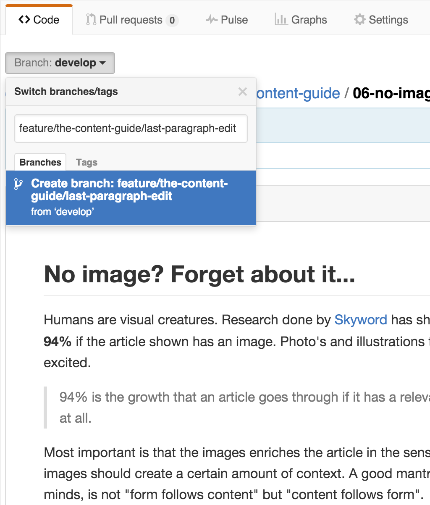
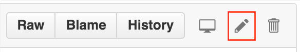
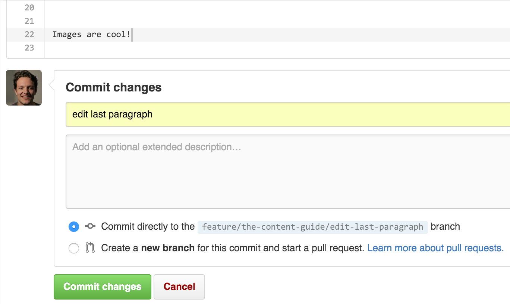
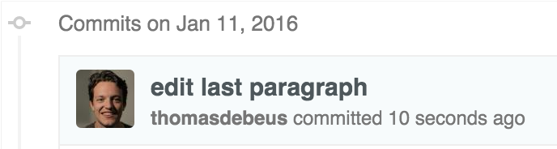
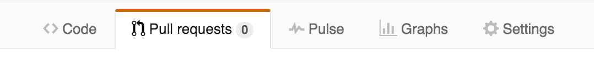
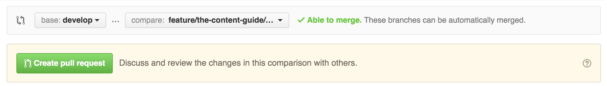
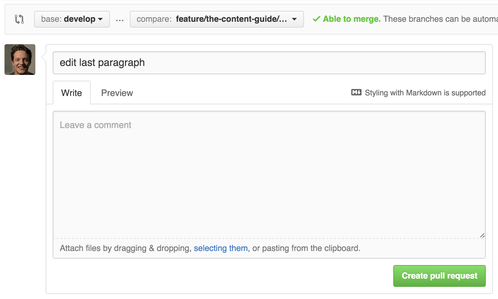
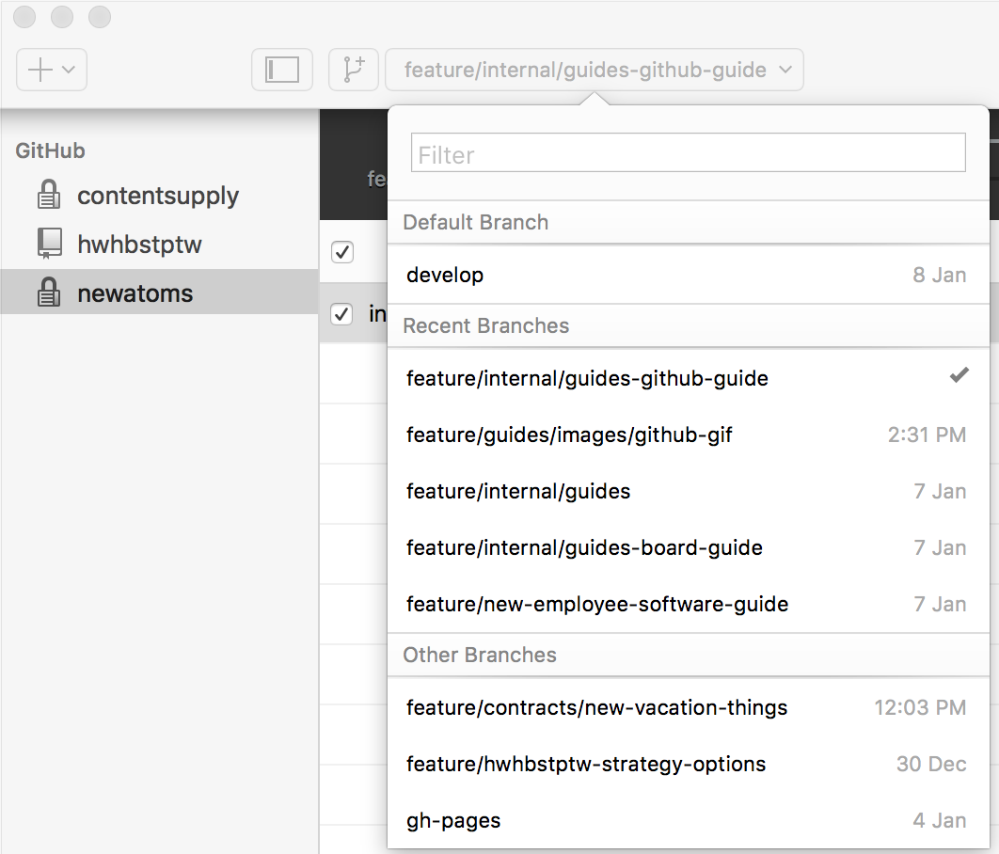
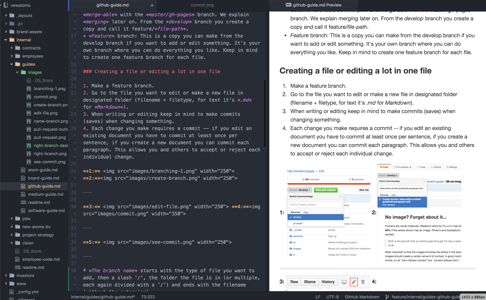

# How to use GitHub

Github is a tool that we use for the creation of all our content and code. In the core it is comparable with how you can work on one google document with multiple people trough suggesting changes. Github works on the same principle but way better, cooler and safer.

Github is a tool that enables the users to very safely improve things that are created in small comprehensive steps that get checked by another user. This way everyone can freely contribute to what you are building without the fear of adding something permanently that other people thin is bad. It is mainly designed with the idea that nothing great is ever made by one person, and that the easyer and safer it feels to improve something the better it is what is created.

In opposition to the system used by things like Google Docs and Microsoft Word, GitHub works with a version control system based on commits and branching. This means every collaborator has an own version – or branch – they work on, and which is then explicitly merged with those of their collaborators. Every change is added to a branch with a commit, in which the contributor explains what he has added in a short message.

The explicit merging of your contributions with those of others creates a natural moment for everyone to look at the things that have changed, give feedback and review.

Github has quite a steep learning curve, but once you go Github you'll never want anything different.

## Working with Github in your browser

We work with multiple repositories (i.e repo), which can be seen as a harddrive containing all the files from that project or product. Always read the readme file that is opened automatically if you enter a repo.  All our research is stored in folders like insights, private and internal (i.e. market research, all kinds of guides, customer acquisition, pitch decks enz.). Folders with a lower dash before the folder name in repositories are not rendered on websites, but they're still viewable by anyone who can access the repo. We also store a lot of our sites in the repositories (e.g. html, layout etc.).

### Github hierarchy

Github works with branches. We work with the following hierarchy:

* The *live* branch: The content of these branches is 'live' and always works. For example, the website (if any) is rendered from files from this branch. **Old vocabulary**: *master* or *gh-pages* branch.
* The *ready* branch: This is a copy of the *live* branch. Here, documents should be fit to print and *merge-able* with the *live* branch. It is a last check before we push the content to the 'live' branch. We explain *merging* later on. From the *ready* branch you create a new branch and give it a selfexplanory name.

### Creating a file or editing a lot in one file

1. Go to the file you want to edit or go to the folder where you want to create a new file.
2. Make an *add* branch.
3. Make a new file in designated folder (filename + filetype, for text it's *.md* for *Markdown*).
4. When writing or editing keep in mind to make commits (i.e. saves or changes) when changing something.
5. Each change you make requires a commit -- if you edit an existing document you have to commit at least once per sentence, if you create a new document you can commit each paragraph. This allows you and others to accept or reject each individual change.

Example: add/internal/guides/medium-guide

---

**1:**  **2:**

---

**3:**  **4:**

---

**5:** 

---

### How to name a branch

It starts with the type of file you want to add (a new file is almost always added as 'add'), then a slash '/', the folder the file is in (or multiple, each again divided with a '/') and ends with the filename (without the extension).
E.g. I created the following branch for this file: add/internal/guides/github-guide

### The Pull request

If you're happy with all your changes in your new file, you have to make a *pull request*. Now your changes will be reviewed by somebody else who will either comment, add commits (changes) or merge the request (this means the file is good to go). Created pull requests will also be visible on our [board](board-guide.md) in the interface because now somebody can pick up this card to review a pull request.

---

**1:** **2:** 

---

**3:**

---

**4:**

---

You created a create pull request! Congratulations! Every time it feels great.

If somebody comments the original owner and everybody who has commented/commited to the pull request will receive a notification.

### A shortcut when changing something small

When changing something small you can go to the designated file and hit the edit icon. Do not commit directly on the ready branch, because that would be illegal, but choose the option to *'Create a new branch for this commit and start a pull request'*.

### Discuss and Merge

You can edit a pull request or comment on certain parts of the file by clicking the + sign on the left. When you click, your comment will be visible in the conversation menu.

When everyone is happy about the document and the file is fit to go to the ready branch, you push the big green merge button on the bottom of the conversations menu. Congratulations, now your branch is *merged* with the ready branch and is fit to print.

## Working local on your own device

Working local means that you *clone* (i.e. copy) a repository from the Github client to your local device in your own designated folder.

You need to download [Github Desktop](https://desktop.github.com/) and a text editor, for example: [Atom](https://atom.io/). See also our [Atom guide](atom-guide.md) for further consult. A text editor comes in handy when writing a bunch of text.

[*Cloning a repository*](https://help.github.com/desktop/guides/contributing/cloning-a-repository-from-github-desktop/) means that you copy a repository from the browser on your device in your own folder architecture. You do this in your Github desktop application.

Make sure you select or create the right branch in the Github desktop. Never commit to the ready/live branch itself.

Any change you'll make to a file in the folder (or subfolder) on your device results in a uncommitted change. If you press commit changes, you in fact update your *local* branch. You now will have to publish, in order to show your changes in the browser for other to see. Sync, if you want to push the local changes to an existing online branch with the same name or if you want to update local branch with the content of the online branch.

So, there are two branches with the same name, one local and one online. Team members can't see your local changes and your local branch also doesn't automatically copy changes from the online branch. It takes an action from you to sync them.

Therefore, if you want to change or add a file you sync with the most recent branch on that repo that deals with the particular work you want to work on. This is often the branch *ready* if you create a new file and always the same as your local branch if it already exists.

### Add images

Only locally you can add images by saving them in the designated folder (e.g. images-folder).

---

---

Then, you can start your text editor and open the repository on which you want to work on. Following image shows text editor Atom with on the left pane the local repository folder. Then you see the syntax pane where you see the Markdown language where this document is built upon. On the right you see the preview window.

---

---

## The dreaded merge conflict

If two people changed the same lines in the same file, or if one person decided to delete it while the other person decided to modify it, Git simply cannot know what is correct. Git will then mark the file as having a conflict - which you'll have to solve before you can continue your work. Git will tell you which line resulted in a merge conflict by copying that line to the top of your document. You have to decide, together with the other person who merged the file, which version is correct.

See [Github's how to](https://help.github.com/articles/resolving-a-merge-conflict-from-the-command-line/) to deal with the merge conflict. Unfortunately this can't be done from the desktop client but has to be done from a terminal. Contact a technical developer in Slack if you are having problems solving the merge conflict.

## Markdown 

As mentioned in the Medium post, we work with Markdown for text files. You can save Markdown files by adding the .md extension.

Markdown is a text-to-HTML conversion tool for web writers. Markdown allows you to write using an easy-to-read, easy-to-write plain text format, then convert it to structurally valid HTML.
[This is a great Markdown guide/archive](
https://daringfireball.net/projects/markdown/basics) where you can learn how to make headings, make text bold and emphasize, use the right syntax for images and hyperlinks, make lists and tables.
