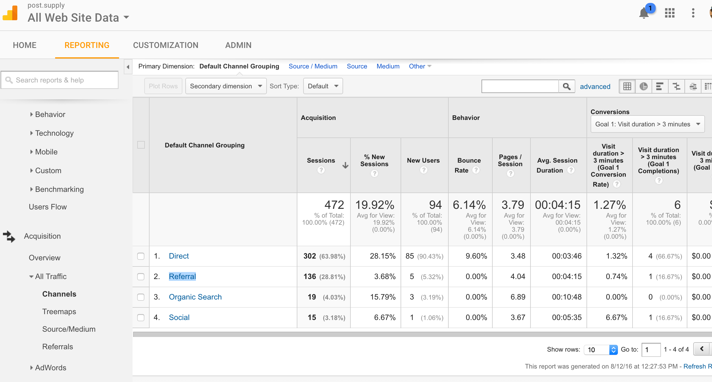

> Goal of this guide: get familiar with Google Analytics

# How to use Google Analytics to your advantage

Google Analytics is a powerful tool and has a lot to offer. It can be quite overwhelming at first, but don't let that stop you. In this guide you will find a few basic pointers, such as which functionalities to look for.

## Get started
You will need a Google account to get access. Ask Boris for a link. Once on the website, go to "Reporting". Here you will find an overview of the last month's traffic.

## The dashboard


Everything you see on this page relates to the selected timeframe. By clicking on the date in the top right (red outlined), you can compare it to a different time frame as well (for example the month before).

You can hover over all the data to see more information on what they show you.


## General useful functionalities
In the menu sidebar (red outlined), you can scroll down to find a few particularly useful functionalities:

* **Behavior**: shows you on which page people land (```Landing pages```) and exit (```Exit pages```), and exactly how much time they spend on which page (```All pages```)
* **Acquisition**: shows you where visitors came from (```All traffic``` > ```Source/Medium```)
* **Adwords**: when running an Adwords campaign you can keep track of everything here.

## Setting goals

To determine the above, it is a good idea to set goals with Google Analytics.

You can do this by selecting ```ADMIN``` in the top, leading to this screen:


Select ```Goals``` (outlined in red). Here you can add goals (up to 18). The idea is that you track a specific thing happening, with URLs, Time, Pages/visit or Events. For example, each time a visitor ends up on a specific page (for example, the "thank you for your sign-up" page) the goal is triggered.
The amount of these 'triggers' in the pas 7 days shows under Conversions.

See here a more extensive guide on [how to make useful goals](https://blog.kissmetrics.com/critical-goal-types/). For example, it is explained even how you can measure how many times a specific link gets clicked on.

## From which site did visitors come?

With Google Analytics you can investigate how visitors came to your site. Did they for example click the link on a certain blog?



1. In the top horizontal bar select: **Reporting**
* In the left side navigation select: **Acquisition, All traffic, channels**
* Scroll down on the main page and in the Default Channel Grouping (main chart, second column) click: **2. referral**
* Scroll down a bit and click on the site you're interested in.  

## Using filters

Select ```Filters``` (outlined in red) to see which filters currently apply to our account. These can be used to for example filter out all kinds of traffic. For example pageviews coming from the New Atoms IP address, making sure that we don't include our own visits in the data.

Be careful with filters! They have an immediate and lasting effect. Always keep a profile without filters. [Read more on filters here](http://online-behavior.com/analytics/filters).
