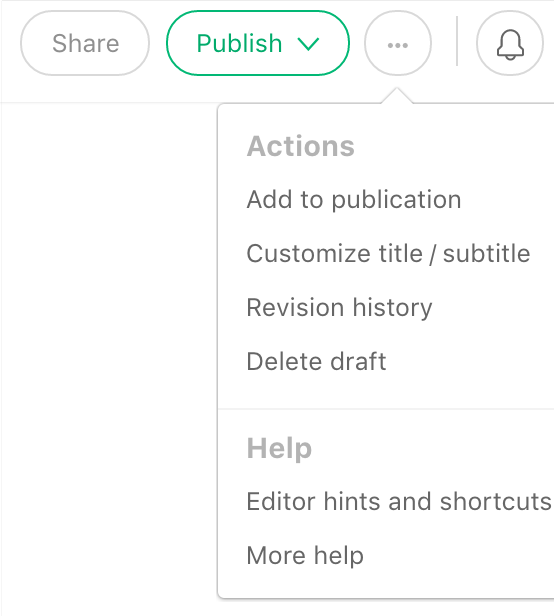
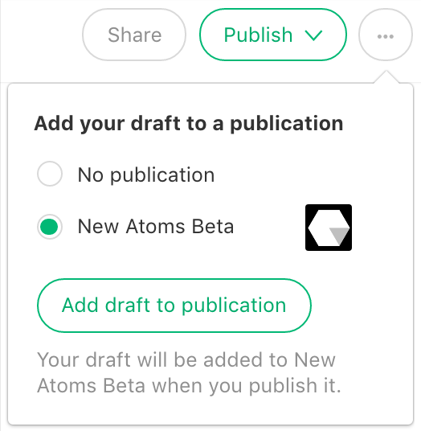

> **Goal of this guide:** giving you the ability to write and publish an article on medium.com

# How to publish to Medium

At New Atoms we write on our [New Atoms Medium Blog channel](https://medium.com/new-atoms-beta). We write about what we learn and what it's like to start a business. Every team member can pitch ideas for blogposts in the Slack channel: beta.

This guide is a quick tutorial about how to create a blogpost.

> **Frequent dispatches from the front of journalistic experimentation.**

>New Atoms is an early-stage news, journalism and research organisation with collaboration — both between humans, and humans and computers — at its core.

Signup on [Medium](https://medium.com/) and ask a team member to invite you as an editor.

## Write and publish

Click on your profile pick and select new story. You can now write your blogpost add images and make up your text. The [Medium Help center](https://help.medium.com/hc/en-us) learns you a lot about how you can make things work.

To publish a story on the New Atoms Channel, do the following:

If you've written your awesome post, choose add to publication an then tick the New Atoms channel. Add draft to publication, now others can review your post because its in draft & stories.

1. 2.  

## Edit

If you're asked to review or edit a medium blogpost always comment and not change. The writer should choose to implement comments. When commenting on text just highlight the text where you want to comment on. Click the comment icon  and send.

## Publish and post

Before publishing you can attach tags to your post. Choose the ones that are most relevant and have the greatest reach. When you're finished and happy with your blogpost you can push the publish button.

Congratulations! Now it's out in the open. Shared to everyone, you can even create a tweet or on the New Atoms [Twitter](https://twitter.com/NewAtoms) account and/or post on the New Atoms [Facebook](https://www.facebook.com/newatoms/).
