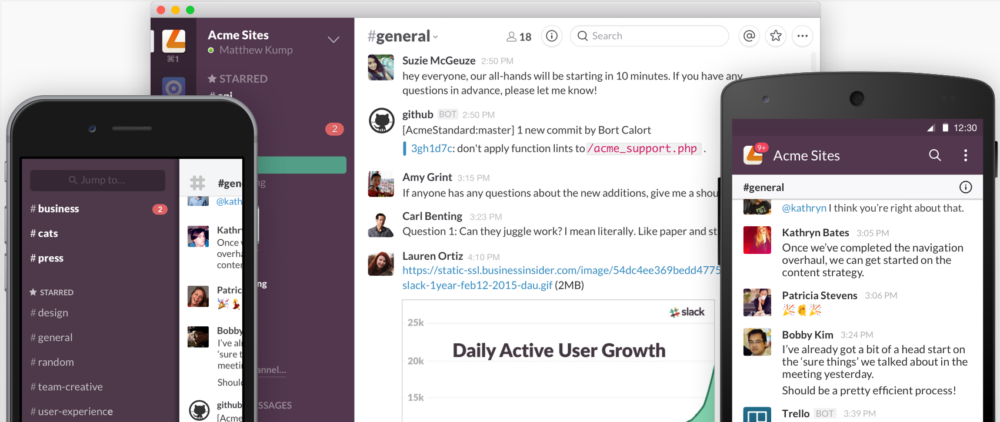

> **Goal of this guide:** Explaining the basics of Slack, our main internal communication tool and how we use it within New Atoms.

# How to use Slack for team communciation 

> I Slack, you Slack, we all Slack

> We're Slacking, until Slack.  
> *-verb*

## Why we use Slack

We try to communicate asynchronous so that everyone can choose how and when they are involved in a conversation. At one moment you might want to engage in team discussions instantly while at other moments you might want to focus and read up on the discussions at a later time.

We try to keep all our communication documented, so that we can later access all those awesome insights we have.

Email is formal and it can be hard to have real conversations over email. Chat is perfect for these things, and Slack is a great chat tool.

## About Slack

Slack is an amazing chat tool, that lets you chat privately with one or multiple people, create and manage channels, send and archive files of all different types, lets you integrate other programs, enables you to automate processes and a bunch more.

Your can download the [Slack desktop application](https://slack.com/downloads) for your computer and you can get the app for your smartphone in the app store.

To get more in depth information about the functionality of Slack [they've made a pretty comprehensive overview](https://get.slack.help/hc/en-us/categories/200111606).    

## How we use Slack

With [Slack](https://slack.com/) we say goodbye to email. Well, certainly for all internal communication.

When you become part of New Atoms you will get an invite, this will enable you to become part of the New Atoms Slack team and join all our channels.

### Channels

Next to private chat and chatrooms you know from traditional chat programs, Slack introduces open and private "Channels"

* Open Channels are for conversations that are open to all team members. Messages posted to channels are archived and searchable to the entire team. Everyone in the New Atoms team can join all the open channels. Open channels have the "#" symbol in front of their name.

* A private channel and its contents are visible and searchable only to the channel members. In order to become part of a private channel you need to be added by a admin of that specific channel. Private channels have a closed lock icon in front of their name.

We organise our team conversations in channels. We make channels per project or product. Apart from these project channels we have a bunch of extra channels that are quite self explanatory. 

We have:

- An inspiration channel, if you want to share interesting links or articles or if you invented an amazing quote. 
- A general channel, here messages go when every New Atoms member should be notified. 
- A random channel, for all the fun things happening and please post your favorite Gifs here 🎉. 
- A improvement channel where you should post your ideas on how we can improve stuff, from processes to behavior.

And many more.

All messages must be on topic and send in the designated channels. You can favorite channels by starring them.

You can mention and notify certain people in a channel with an *@* followed by that user's Slack handle.   

### Direct Messages

To reach a team member directly, send them a Direct Message. To send one, select the recipient from the direct message column on the left of the window. If the person you are trying to send a message is not in the list you can add them by clicking the private message heading. Direct messages are only visible for those in that conversation.

### Add niceness to your messages

You can add some fancy formatting to your messages like Bold using `*` before and after what you want to be bold; use `_` for italics and `~` for strikethrough. [Read more about formatting on the Slack site](https://get.slack.help/hc/en-us/articles/202288908-Formatting-your-messages). Note: Slack does not use Markdown.

You can also generata a random gif about a subject by typing `/giphy [subject]`. Pretty cool.
