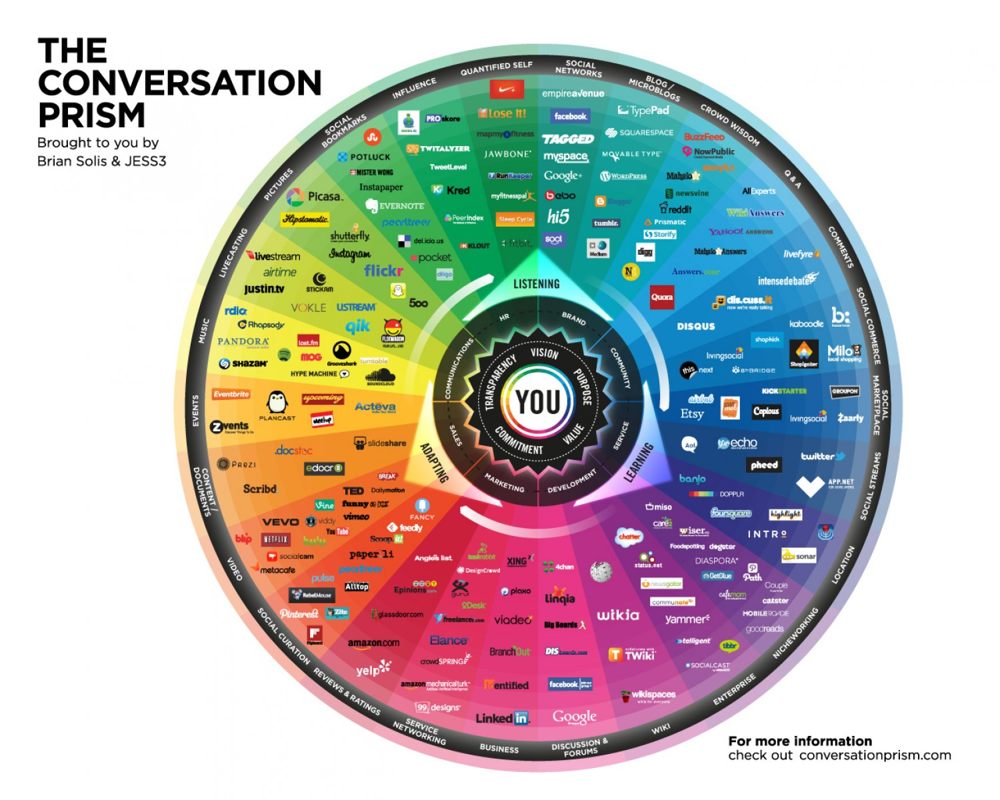

> **Goal of this guide**: to help you understand the inner workings of social media so you can use them to your advantage.

*Landscape of social media*

# How to use social media for communication

Social media is an extremely amplified version of [word of mouth](../understand-content-marketing/readme.md#word-of-mouth) communication.
It has the potential reach of traditional broadcasting and the context of word of mouth.

## The fundamentals of social media

Here you will find some key concepts about social media that will help you to successfully use social media for communication purposes.

* What someone tells you influences the way you perceive them and vice versa.
* The sender always lends connotation (emotional association) to the message and the message always lends connotation to the sender.
* The sender is always visible.
* Everything you say and share is documented, visible and broadcasted for a short duration to all involved accounts and their followers. This duration is extended every time someone interacts with it.
* Whenever you "like" something, it is documented on the "liked" item and broadcasted to all affected accounts. This duration can not be extended and the action is not visible on your profile.
* Everyone using social media has the possibility to get infinite reach.
* For Twitter, the broadcast time is roughly 15 minutes; for Facebook this is about 90 minutes; and for linkedIn it is over 48 hours.
* Everything you broadcast reaches your followers and the followers of people who interact with your broadcast during the time it is broadcasted.
* Only people directly affected by your actions get a notification; the rest is reached through their news feed.
* People generally don't click: interactions with messages of big brands are 00,7% on average and roughly 1-2% for the average commercial profile.

## How best use social media

Traditional use of social media is to reach and convey a direct message to your target audience, for example: we are selling this, we are doing that, you can find us here.

Social media is the best way to reach a lot of people, but it is meaningless if there is no immediate benefit for the receiver, especially if the receiver does not know who you are. The biggest misunderstanding of communication is that people expect a direct return of investment.

* **Expectation**: I see something I like, I interact with it.
* **Reality**: I see something I like, but don't specifically and immediately need, I might remember it and keep on doing what I'm doing.

The value of your message to the reader is the cornerstone of the effectiveness of your social media use. If you try to convey too many meaningless messages, the value of your content stream drops and people stop listening.

The best use of social media is not only to reach and convey a direct message to your target audience, but also to build and maintain a relationship.

Building a relationship and broadening your reach is done in the same way: be relevant for your target audience and leave a positive memory.

In short: **Give the reader value for their time.**

A way to do this is to communicate from your beliefs and not be afraid to share the secrets of the trade. The competition will always be different and the knowledge you share only manifests your confidence and capabilities.

## What do people share?

To broaden your reach, you want people to share what you say. Items with marketing purposes that get shared a lot on social media are called viral marketing.

In the paper: [Viral marketing: Motivations to forward online content](https://www.deepdyve.com/lp/elsevier/viral-marketing-motivations-to-forward-online-content-ya990JKm7A), Jason Y.C. Hoa and Melanie Dempsey identify four potential motivations for people to share content:

1. the need to be part of a group
* the need to be individualistic
* the need to be [altruistic](http://dictionary.cambridge.org/dictionary/english/altruistic)
* the need for personal growth

Using a survey of young adults, they found that internet users, who are more individualistic and/or more altruistic, tend to forward more online content than others.

You do not want people to only interact with your messages, but to do so in a positive manner. You want people to speak positively about you with personal incentive.

This can be done by saying something about you, but just sharing or even liking your messages is enough. The best way to get your readers to do this is simply by giving them a reason to. To do this, it is important to know why people interact with messages on social media.

## Why do people share?

Your social media profile is a definition of who you are. It is your public resume, your dating profile and your portfolio. So with everything you share and say you should ask yourself:

> Is this portfolio material? Would I endorse this and how does it look with the rest of my profile?'

Because you only reach the people during the time of your broadcast, it can often be good to broadcast the same message multiple times and give the receiver a reason to share it every time.

This is the main reason why non-profit organisations and education institutes are so successful on social media. Their messages are directly relatable to the people sharing them and lend a strong connotation to the sender and the sharer.

## Practicality

Here are some insights that have been drawn from research on social media:

* In general, people only briefly look at what they see on social media. Therefore, the first sentences or image they see should capture the reader in a way that is in line with what message you're conveying.

* People hardly click on links (1%-10%), even if they have instant relevance. Therefore, you should limit use of [bitly](https://bitly.com/) and [tinyurl](http://tinyurl.com/) for urls of which the names are not relevant or obvious. These are tools to shorten your links. Although your audience doesn't recognise your link, it can be handy for tracking.

To make sure that people can find your content again, **it is important to keep the following things in mind**:

* Try to keep your content on a minimal amount of different outlets and channel it through social media.
* If you publish an article online, do so on a blog and link to that blogpost through different platforms. Don't post the article multiple times on different platforms. You want people to be able to share the source, not necessarily the outlet.
* If you are using video, try to keep all your material on one outlet (Vimeo, YouTube, etc.)
* Be consistent in language, frequency and use of external services.

## Practicality per platform

Here you will find some info specifically pertaining to the mentioned social media platforms.

### Twitter

* Mostly used for building and maintaining a network, conveying and receiving current events to and from your followers.
* Mixed professional and personal use.
* Shows all the messages people you follow post in real time.
* @Mentions give a notification for the mentioned and show up in the feed of their followers.
* If “@” is at the beginning of a sentence, the tweet is a direct message and only visible to the receiver defined by the “@”.
* There's a 140 character limit, images “cost” 25 characters, links 23 characters.
* Hashtags are used for 2 things: search labels and making or taking part in a phenomenon. [Mastering your hashtags can be an art of its self](http://www.inc.com/jeff-haden/the-science-behind-using-hashtags-number-type-and-more.html).

### Facebook

* Most used and broadest platform, mostly personal use.
* Shows messages of the people you follow based on your profile information, what and how long you view something and what you click on.
* Suggests (sponsored) post and pages based on that information.
* Tags give notifications to the tagged and show up in the timeline of their friends.
* Facebook has the potential of infinite reach, so always reach beyond your followers.

### LinkedIn

* Used for profiling yourself and others, career-oriented.
* Professional use.
* Shows messages from the people you follow in real time and suggests messages, jobs, companies and connections based on your profile information and what you click on.
* 600 character limit.
* Only the first 150 Characters are visible; the rest is hidden behind “read more”.

## The very last bullet point list; A summary of advice

Hopefully you were able to read through the endless list of bullet points. In order to make the bullet points more clear, we filtered out some of the most important points and made another bullet point list! We love bullet points! The list below is meant to give you a summary of advice on how to use social media based on the concepts discussed in this guide.

* Roughly define your target audience.
* Choose your platforms based on your target audience.
* Use your social media to build and maintain a relationship with your target audience.
* What you share should have value for your target audience outside the context, so that it lends connotation instead of taking it.
* Always reach past your followers and assume that readers have never seen a post from you before.
* Be honest and transparent; always be clear about the source of your content.
* Give it time; don't expect instant results. The average successful blog takes 3 years to build up a stable flow of visitors.
