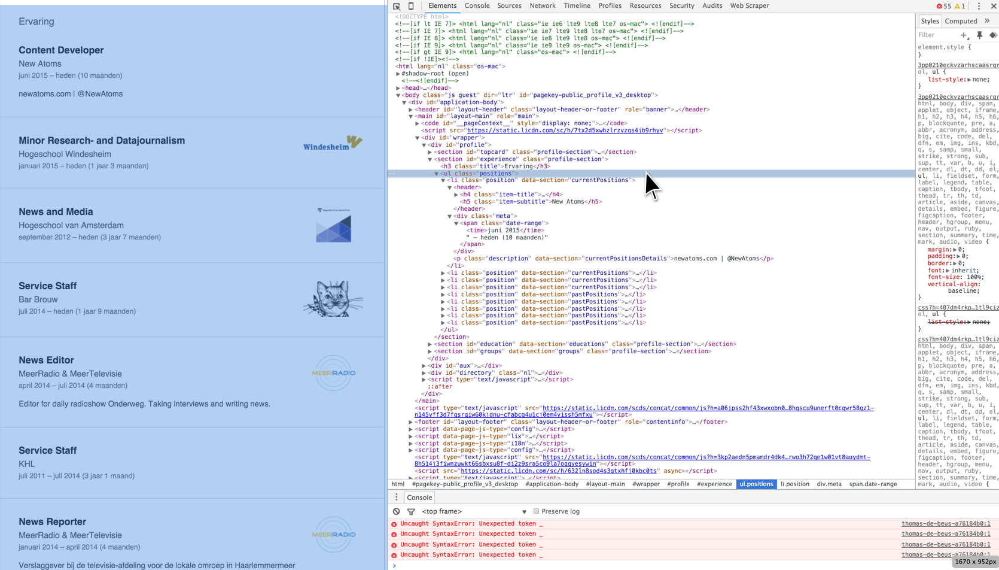

> **The goal of this guide:** You will learn how to extract information from LinkedIn using [developer tools](../fixing-errors/readme.md), [node.js](http://blog.modulus.io/absolute-beginners-guide-to-nodejs) and [X-Ray](https://www.npmjs.com/package/x-ray).

# How to scrape information from LinkedIn

With [node.js](http://blog.modulus.io/absolute-beginners-guide-to-nodejs) and [x-ray](https://www.npmjs.com/package/x-ray).

You can of course start here at [hackertyper](http://hackertyper.com/) and do your [swordfish](http://www.imdb.com/title/tt0244244/?ref_=nv_sr_1) magic! 🤓

Web scraping enables you to extract information from the web and put it in a more workable format (*.json*, *.csv*, *excel*, *google spreadsheets*).

## First things first

1. Create a file `'filename'.js` in your designated folder. In this file you will write your code.

* Open the [Terminal](http://www.macworld.co.uk/feature/mac-software/get-more-out-of-os-x-terminal-3608274/) application on your mac, go to the folder where you created your file by typing `cd 'path to your folder'` enter.

* Install node.js: `npm install node` and enter. Then you need X-Ray: `npm install x-ray` enter.

## Lets start scraping

In this example we extract the 'experience' information from a certain LinkedIn profile. Important is that you don't log in! Or else the html code is different from this example.

### Open Chromes Developer tools

In the Chrome web browser open the devtools with `cmd-alt-i` and click on the parent element:



> With scraping you need to get comfortable with developer tools and with reading html code.

We search 🕵 from top to bottom to find what we want:

* all the information of experience. `class='positions'`
* the title of each experience: e.g. 'Content developer'. `class='item-title'`.
* the organisation of each title: 'New Atoms'. `class='item-subtitle'`.
* finally, the date and time the person was active under that title and organisation: `class='.date-range'`

This ↓ is all the code we need. Not very scary, aint it?

```javascript
var x = new require('x-ray')()

x(
  'https://nl.linkedin.com/in/thomas-de-beus-a76184b0',
  {
    items: x(
      '.position',
      [ {
        title: '.item-title',
        organisation: '.item-subtitle',
        time: '.date-range'
      } ]
    )
  }
).write('results.json')
```
So lets guide you through this code:

1. Create a variable that will execute your x-ray. `var x = new require('x-ray')()`
* Now `x` will look at a Linkedin url.
* Next, the code will run the containing information of the called classes.
* With `.write('results.json')` the scraped information will be printed out in a newly created `results.json` file on your computer.
* To actually see 👀 your scraped information in your results.json file go to your terminal and call the code with typing: `node 'filename'.js`. Voila! There it is! 🎉

## Results in your .json file:

You can convert these .json files into .csv files by pasting it [here](http://konklone.io/json/), download it and eventually import it in spreadsheet programs or [Open Refine](http://openrefine.org/). This way you have a better overview and you could work your spreadsheet magic for analysing.

```json
{
  "items": [
    {
      "title": "Content Developer",
      "organisation": "New Atoms",
      "time": "juni 2015 – heden (10 maanden)"
    },
    {
      "title": "Minor Research- and Datajournalism",
      "organisation": "Hogeschool Windesheim",
      "time": "januari 2015 – heden (1 jaar 3 maanden)"
    },
    {
      "title": "News and Media",
      "organisation": "Hogeschool van Amsterdam",
      "time": "september 2012 – heden (3 jaar 7 maanden)"
    },
    {
      "title": "Service Staff",
      "organisation": "Bar Brouw",
      "time": "juli 2014 – heden (1 jaar 9 maanden)"
    },
    {
      "title": "News Editor",
      "organisation": "MeerRadio & MeerTelevisie",
      "time": "april 2014 – juli 2014 (4 maanden)"
    },
    {
      "title": "Service Staff",
      "organisation": "KHL",
      "time": "juli 2011 – juli 2014 (3 jaar 1 maand)"
    },
    {
      "title": "News Reporter",
      "organisation": "MeerRadio & MeerTelevisie",
      "time": "januari 2014 – april 2014 (4 maanden)"
    }
  ]
}
```

## Scrape multiple targeted URL's and parent classes

The following code will create separate .json files containing the working experience and school history of our beloved employees Sam Prinssen, Matthijs Mentink and Thomas de Beus.

```javascript
var profiles = [
    'https://nl.linkedin.com/in/sam-prinssen-6a101522',
    'https://nl.linkedin.com/in/thomas-de-beus-a76184b0',
    'https://nl.linkedin.com/in/matthijs-mentink-1ba4651a'
  ]

var x = new require('x-ray')()

for (var i = 0; i < profiles.length; i++) {
  var profile = profiles[i]

x(
  profile,
    {
      work: x(
        '.position',
        [ {
          title: '.item-title',
          organisation: '.item-subtitle',
          time: '.date-range'
        } ]
      ),
      school: x(
        '.school',
        [ {
          school: '.item-title',
          type: '.item-subtitle',
          time: '.date-range'
        } ]
      )
    }
  ).write(profile.replace(/\//gi, '-') + '.json')
}
```
